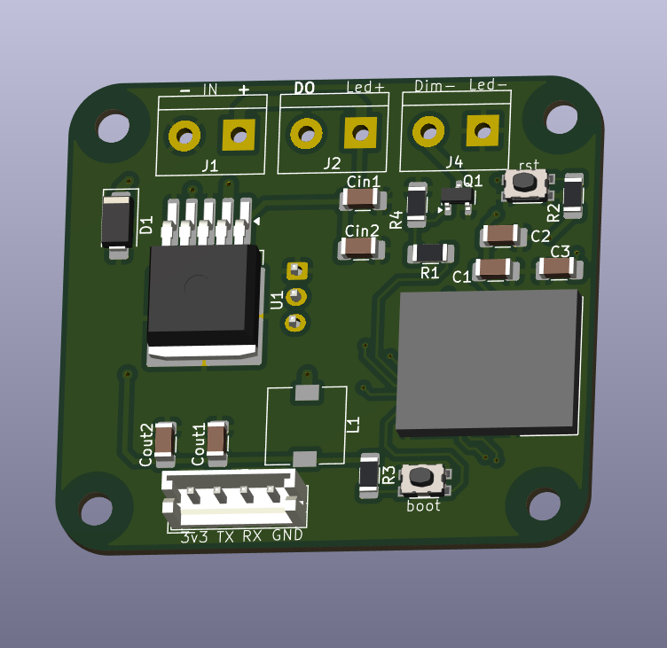
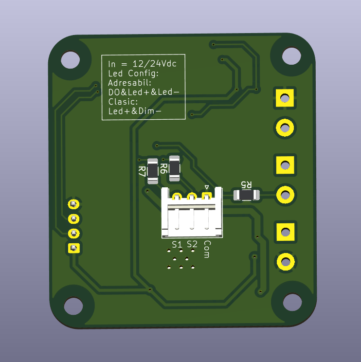

# LED Controller (ESP32-C3-Mini)

## Power
- Input: 12 or 24 VDC on J1 connector

## Connections for Digital LED
- DO (DATA) 
- LED+ = VCC
- LED- = GND

## Connections for Classic LED
- LED+ = VCC
- Dim- = GND

## External Switch (Momentary)

- S1 - Dim down
- S2 - Dim up
- Com - Second connection on the switch (common for both)

## GPIO Config

- IO4: DATA LED
- IO5: PWM LED
- IO6: Dim Up
- IO7: Dim Down
- TXD0/RXD0: 
- EN: reset/enable
- BOOT: bootloader (IO09)

